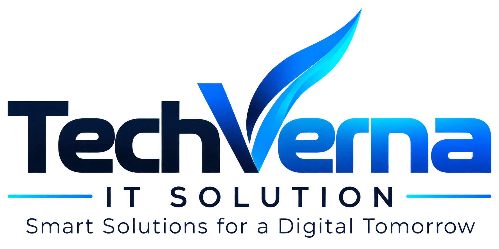

# TechVerna IT Solution



> **Empowering Businesses Through Cutting-Edge Software Engineering & Digital Transformation**

TechVerna IT Solution is a full-service technology agency providing high-performance Web Development, Mobile Applications, SaaS Platforms, Custom Backend APIs, AI Integrations, and Intelligent Business Automation solutions. Built with modern web standards, the site delivers a lightning-fast, fully responsive, and accessible user experience.

---

## 🚀 Key Features

- **Zero-Framework Overhead**: Built entirely with pure HTML5, CSS3, and Vanilla JavaScript for maximum performance and instant load times.
- **Fully Responsive Design**: Optimized across mobile, tablet, and desktop viewports with a custom mobile drawer navigation.
- **Interactive UI Components**: Includes smooth gradient hover effects, dynamic FAQ accordions, clickable service cards, and real-time form validation.
- **Executive Leadership Showcase**: Dedicated profile cards featuring the core leadership team with photo portraits and verified LinkedIn/GitHub links.
- **SEO & Search Optimized**: Structured semantic HTML tags, complete `sitemap.xml`, and search engine directives via `robots.txt`.

---

## 📁 Project Structure

```text
TechVerna/
├── index.html                    # Main landing page (Hero, Services, Solutions, Team, Contact CTA)
├── about.html                    # Company overview, executive leadership team, & core values
├── services.html                 # Comprehensive list of technology & engineering services
├── solutions.html                # Industry solutions (FinTech, E-Commerce, Healthcare, Enterprise)
├── work.html                     # Featured client case studies & portfolio showcase
├── contact.html                  # Interactive contact form with company location details
├── faq.html                      # Interactive Frequently Asked Questions page
├── privacy.html                  # Privacy policy documentation
├── terms.html                    # Terms of service agreement
├── robots.txt                    # Search engine crawler configuration
├── sitemap.xml                   # XML Sitemap for search indexing
│
├── assets/                       # Image assets & media
│   ├── logo.png                  # Main site logo
│   ├── logo-footer.png           # Dark-background footer logo
│   └── team/                     # Executive team profile portraits
│       ├── akash.jpg             # Akash Kumar Singh (Founder)
│       ├── raj.jpg               # Raj Solanki (Co-founder)
│       ├── narayan.jpg           # Narayan Kumar (CEO)
│       ├── adarsh.jpg            # Adarsh Kumar (CTO)
│       ├── vishal.jpg            # Vishal Kumar (Managing Director)
│       └── aryan.jpg             # Aryan Kumar Singh (Business Development Executive)
│
├── css/                          # Stylesheets
│   ├── style.css                 # Core CSS variables, typography, navigation & layout styles
│   ├── responsive.css            # Media queries & mobile responsiveness
│   └── animations.css            # Smooth page scroll & component keyframe animations
│
├── js/                           # JavaScript modules
│   ├── main.js                   # Service card interactions & global utility scripts
│   ├── navigation.js             # Mobile hamburger menu & drawer toggle logic
│   ├── contact.js                # Contact form input handling & validation
│   └── faq.js                    # Accordion toggle behavior
│
└── services/                     # Individual service detail pages
    ├── web-development.html
    ├── mobile-development.html
    ├── saas-development.html
    ├── backend-api-development.html
    ├── ai-development.html
    └── business-automation.html
```

---

## 🛠️ Core Services

1. **Web Development**: Custom web applications built with modern frontend architecture, robust security, and high performance.
2. **Mobile Development**: Native and cross-platform mobile apps for iOS and Android tailored for user engagement.
3. **SaaS Development**: Scalable multi-tenant cloud platforms designed for enterprise growth.
4. **Backend & API Development**: High-throughput microservices, RESTful APIs, and database architectures.
5. **AI Development & Integration**: Intelligent Machine Learning model integration, AI automation, and predictive analytics.
6. **Business Automation**: Custom workflow automation and digital transformation tools to optimize business operations.

---

## 👥 Executive Leadership Team

- **Akash Kumar Singh** — *Founder*
- **Raj Solanki** — *Co-founder*
- **Narayan Kumar** — *Chief Executive Officer (CEO)*
- **Adarsh Kumar** — *Chief Technology Officer (CTO)*
- **Vishal Kumar** — *Managing Director*
- **Aryan Kumar Singh** — *Business Development Executive*

---

## 💻 Local Development & Setup

Since TechVerna IT Solution is built with static web standards, no compilation or npm installations are required.

### Quick Start:

1. **Clone the Repository**:
   ```bash
   git clone https://github.com/techvernaitsolution/TechVerna.git
   cd TechVerna
   ```

2. **Run a Local Web Server**:
   You can serve the directory using any static file server:

   - **Using Python 3**:
     ```bash
     python -m http.server 8000
     ```
   - **Using Node.js (`http-server`)**:
     ```bash
     npx http-server -p 8000
     ```
   - **Using VS Code**:
     Open the workspace in VS Code and click **"Go Live"** via the *Live Server* extension.

3. **View in Browser**:
   Navigate to `http://localhost:8000` (or `http://127.0.0.1:8000`) in your web browser.

---

## 📄 License & GitHub

- **Official GitHub Repository**: [github.com/techvernaitsolution](https://github.com/techvernaitsolution)
- **Copyright**: © 2026 TechVerna IT Solution. All rights reserved.
